==========================
ipywidgets_toggle_buttons
==========================

.. image:: https://img.shields.io/github/last-commit/stas-prokopiev/ipywidgets_toggle_buttons
   :target: https://img.shields.io/github/last-commit/stas-prokopiev/ipywidgets_toggle_buttons
   :alt: GitHub last commit

.. image:: https://img.shields.io/github/license/stas-prokopiev/ipywidgets_toggle_buttons
    :target: https://github.com/stas-prokopiev/ipywidgets_toggle_buttons/blob/master/LICENSE.txt
    :alt: GitHub license<space><space>

.. image:: https://readthedocs.org/projects/ipywidgets-toggle-buttons/badge/?version=latest
    :target: https://ipywidgets-toggle-buttons.readthedocs.io/en/latest/?badge=latest
    :alt: Documentation Status

.. image:: https://img.shields.io/pypi/v/ipywidgets_toggle_buttons
   :target: https://img.shields.io/pypi/v/ipywidgets_toggle_buttons
   :alt: PyPI

.. image:: https://img.shields.io/pypi/pyversions/ipywidgets_toggle_buttons
   :target: https://img.shields.io/pypi/pyversions/ipywidgets_toggle_buttons
   :alt: PyPI - Python Version

.. contents:: **Table of Contents**

Short Overview.
=========================

ipywidgets_toggle_buttons is a simple python package(**py>=3.6**)
with more toggle buttons for ipywidgets

Installation via pip:
======================

.. code-block:: bash

    pip install ipywidgets_toggle_buttons

Long Overview.
===================================================================

This python package consists of other ToggleButtons classes

- ToggleButtonsAutoSize - To adjust buttons size to show full their's description
- MultiToggleButtons - To select a few options at once with usual ToggleButtons interface
- ToggleButtonsWithHide - ToggleButtonsAutoSize + Hidden options
- MultiToggleButtonsWithHide - MultiToggleButtons + Hidden options

| All of them will adjust size of buttons if options are modified.
| Also they have usual interfaces to work with values and options

Simple Usage examples
===================================================================

ToggleButtonsAutoSize
------------------------------------------------------------------------------

Create and show this widget
^^^^^^^^^^^^^^^^^^^^^^^^^^^^

.. code-block:: python
    from ipywidgets_toggle_buttons import ToggleButtonsAutoSize
    wid = ToggleButtonsAutoSize(options=[str(i) for i in range(10)])
    wid  # OR wid.box_widget

.. code-block:: python

    print(wid.value)  # "0"
    print(wid.options)  # ('0', '1', '2', '3', '4', '5', '6', '7', '8', '9')
    print(wid.layout.width)  # '100%'

.. code-block:: python

    wid.options = list(wid.options) + ["ajhfkaghnkandjgnakdn"]

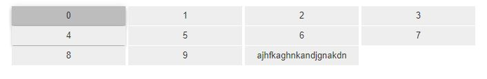

MultiToggleButtons
------------------------------------------------------------------------------

Create and show this widget
^^^^^^^^^^^^^^^^^^^^^^^^^^^^

.. code-block:: python

    from ipywidgets_toggle_buttons import MultiToggleButtons
    wid = MultiToggleButtons(
        options=[str(i) for i in range(10)],
        max_chosen_values=2,
    )
    wid  # OR wid.box_widget

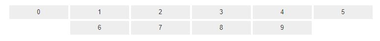

.. code-block:: python

    def on_value_change(_):
        print("pew")

    wid.observe(on_value_change, 'value')
    print(wid.value)  # ()
    wid.value = ["2", "8"]  # "pew"

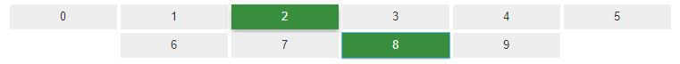

ToggleButtonsWithHide
------------------------------------------------------------------------------

Create and show this widget
^^^^^^^^^^^^^^^^^^^^^^^^^^^^

.. code-block:: python

    from ipywidgets_toggle_buttons import ToggleButtonsWithHide
    wid = ToggleButtonsWithHide(
        value="0",
        options_visible=[str(i) for i in range(10)],
        options_hidden=[str(i) for i in range(5, 15)],
    )
    wid  # OR wid.box_widget

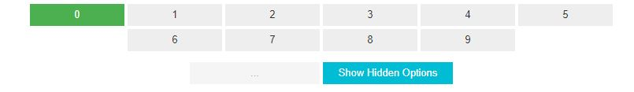

After pressing the button **Show Hidden Options**

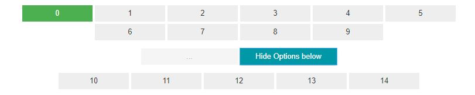

Select value 12

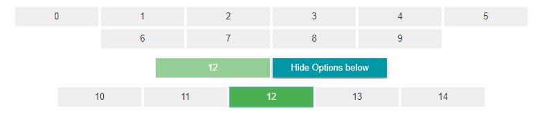

And hide Hidden options

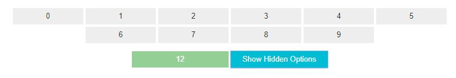

.. code-block:: python

    print(wid.value)  # "12"
    wid.options_visible = [str(i) for i in range(2)]
    wid.options_hidden = [f"another {i}" for i in range(2)]

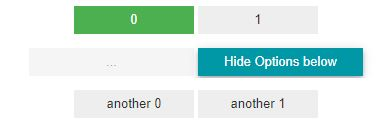

MultiToggleButtonsWithHide
------------------------------------------------------------------------------

Create and show this widget
^^^^^^^^^^^^^^^^^^^^^^^^^^^^

.. code-block:: python

    from ipywidgets_toggle_buttons import MultiToggleButtonsWithHide
    wid = MultiToggleButtonsWithHide(
        options_visible=[str(i) for i in range(10)],
        options_hidden=[str(i) for i in range(5, 15)],
        max_chosen_values=4,
    )
    wid  # OR wid.box_widget

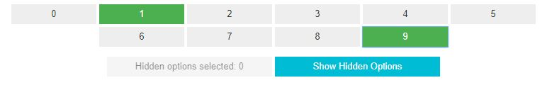

After pressing the button **Show Hidden Options**

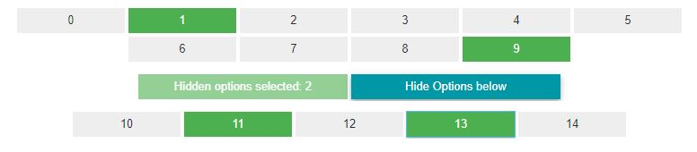

Select a few options and hide all Hidden options

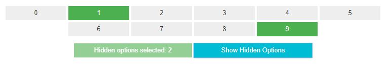

.. code-block:: python

    print(wid.value)  # ('1', '9', '11', '13')
    print(wid.options_hidden)  # ('10', '11', '12', '13', '14')

If at any moment you want to change the options then it can be done like shown below

.. code-block:: python

    wid.options_visible = [str(i) for i in range(2)]
    wid.options_hidden = [f"another {i}" for i in range(2)]

Advanced Usage examples
===================================================================

How to add this widgets into the Box, HBox, VBox
------------------------------------------------------------

.. code-block:: python

    from ipywidget import Box

    wid = AnyToggleButton(
        ...,
        func_to_get_option_width=func_new_width
    )

    wid_box = Box([])

    def func_new_width(iter_options):

        int_max_width = 0
        for option in iter_options:
            cur_but_width = 8 * len(option)
            if cur_but_width > int_max_width:
                int_max_width = cur_but_width
        return int_max_width

How to adjust buttons width differently
------------------------------------------------------------

During the initialization of any widget pass additional argument
**func_to_get_option_width** with function which accepts itterator over options
and returns 1 integer with width to use for this buttons

.. code-block:: python

    def func_new_width(iter_options):

        int_max_width = 0
        for option in iter_options:
            cur_but_width = 8 * len(option)
            if cur_but_width > int_max_width:
                int_max_width = cur_but_width
        return int_max_width

    wid = AnyToggleButton(
        ...,
        func_to_get_option_width=func_new_width
    )

How to access all options of the widget
------------------------------------------------------------

Use attribute **.widget** to get full control over shown widget

.. code-block:: python

    wid = AnyToggleButton(...)
    wid.widget

Links
=====

    * `PYPI <https://pypi.org/project/ipywidgets_toggle_buttons/>`_
    * `readthedocs <https://ipywidgets-toggle-buttons.readthedocs.io/en/latest/>`_
    * `GitHub <https://github.com/stas-prokopiev/ipywidgets_toggle_buttons>`_

Project local Links
===================

    * `CONTRIBUTING <https://github.com/stas-prokopiev/ipywidgets_toggle_buttons/blob/master/CONTRIBUTING.rst>`_.

Contacts
========

    * Email: stas.prokopiev@gmail.com
    * `vk.com <https://vk.com/stas.prokopyev>`_
    * `Facebook <https://www.facebook.com/profile.php?id=100009380530321>`_

License
=======

This project is licensed under the MIT License.